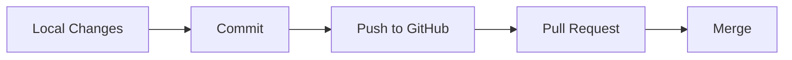
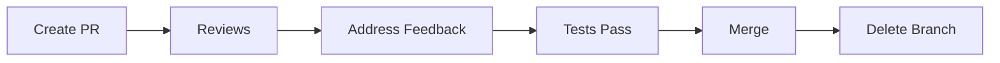

```markdown
```
# GitHub Quick Guide

A concise guide for effective GitHub collaboration using GitHub Desktop.

## Contents
- Key Terms
- Workflows
- Best Practices
- Pull Requests
- Quick Reference

## Key Terms
| Term | Definition |
|------|------------|
| Repository (Repo) | Project folder containing all files and revision history |
| Clone             | Creating a local copy of a repository |
| Commit            | Saving changes with a descriptive message |
| Push              | Uploading local changes to GitHub |
| Pull              | Downloading changes from GitHub to local machine |
| Branch            | Separate version of code for development |
| Main/Master       | Default/primary branch of project |
| Pull Request (PR) | Proposal to merge changes into another branch |
| Fork              | Personal copy of someone else's repository |

## Basic Workflow


## Branch Workflow
1. **Start Point**
   ```
   - Open GitHub Desktop
   - Select repository
   - Ensure main branch
   - Fetch + Pull
   ```

2. **New Branch**
   ```
   - Click 'Current Branch'
   - Select 'New Branch'
   - Name descriptively
   - Create Branch
   ```

3. **Development**
   ```
   - Make changes
   - Review in Desktop
   - Commit to branch
   - Push origin
   ```

4. **Merge Process**
   ```
   - Create PR on GitHub
   - Review changes
   - Request reviews
   - Merge when approved
   ```

## Best Practices

### 1. Clean Branch Strategy
```
✓ One feature/fix per branch
✓ Use descriptive names:
  feature/login-system
  fix/navbar-bug
✓ Delete after merging
```

### 2. Atomic Commits
```
Format:
type: Brief description (50 chars max)

- Detailed changes
- Reasoning
- Impact

Types: feat|fix|docs|style|refactor|test|chore

Good: "feat: Add password validation"
Bad:  "Updates and fixes"
```

### 3. Quality Control
```
Pre-Commit Checklist:
□ Review changes
□ Remove debug code
□ Check for sensitive data
□ Test functionality
□ Run local tests
□ Update documentation
```

## Pull Request Guide

### Structure
```
Title: [Type] Clear description
Description:
- Changes made
- Reason for changes
- Testing instructions
- Related issues

Example PR combining commits:
1. "feat: Add login form HTML/CSS"
2. "feat: Implement validation"
3. "test: Add login tests"
→ PR: "Feature: User Login System"
```

### PR Lifecycle


## Quick Reference

### Do's and Don'ts
```
✓ Pull before new work
✓ Use descriptive names
✓ Write clear messages
✓ Review before commit
✓ Test before PR

✗ Commit directly to main
✗ Mix unrelated changes
✗ Write vague messages
✗ Skip code review
✗ Leave stale branches
```

### Common Desktop Actions
```
Branch → New Branch     : Create feature branch
Fetch Origin           : Check for updates
Branch → Update        : Get latest changes
Changes → Commit       : Save work
Push Origin            : Share changes
```

## Notes
- Keep changes focused and atomic
- Maintain clear commit history
- Test thoroughly before PR
- Communicate effectively with team
- Review changes carefully

---
